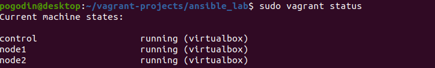
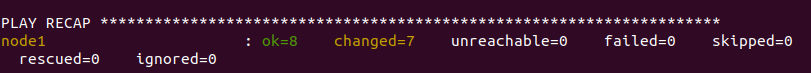
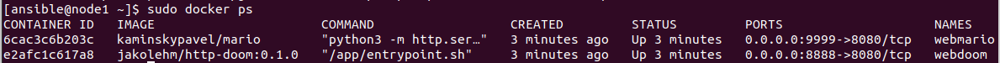
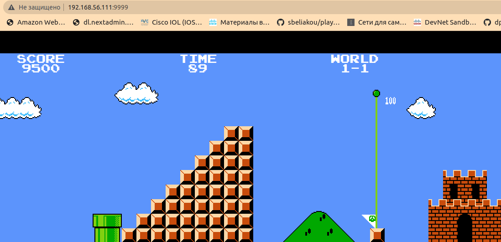
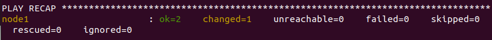
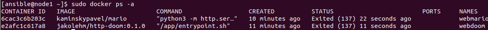

# Курс Ansible: Домашнее задание 1

## Задача 1:

   Проделать практику с разворотом контейнера: запустить сценарий `deploy_container.yaml`
   

   В качестве доказательства выполнения необходимо отправить нам на почту скриншот, в котором будет виден адрес сервера в адресной строке браузера и экран с результатами пройденного(!) первого уровня Mario или Doom на выбор 🤗

   По завершению остановить контейнеры вторым сценарием `stop_container.yaml`.

## Задача 2:

   Настроить `Nginx` для работы по `HTTPS`:

   Скачать сценарий разворота `Nginx` `nginx-no-tls`
   
   Сгенерировать самоподписанные `SSL-сертификаты`
   
   Внести необходимые изменения в конфигурационные файлы и в `Ansible-сценарий`.
   
   Сертификаты можно сгенерировать самостоятельно на управляющем хосте и перенести на конечный хост через модуль copy.

   Дополнительный балл к результату можно получить за самостоятельный поиск, изучение и применение `Ansible-модулей` для генерации приватного ключа, запроса на подпись сертификата, генерации самоподписанного сертификата.

